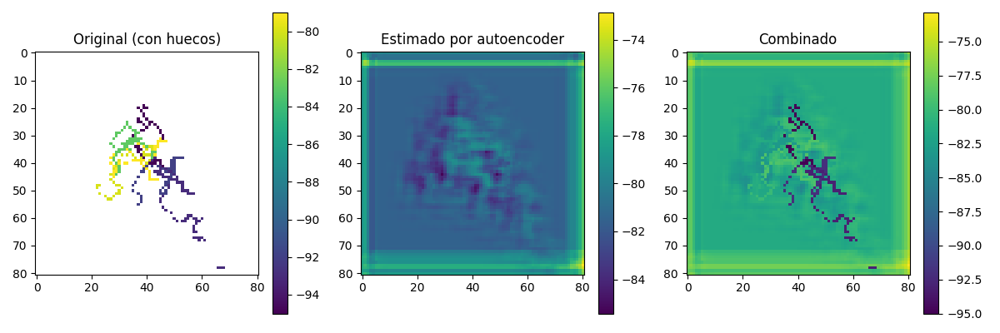
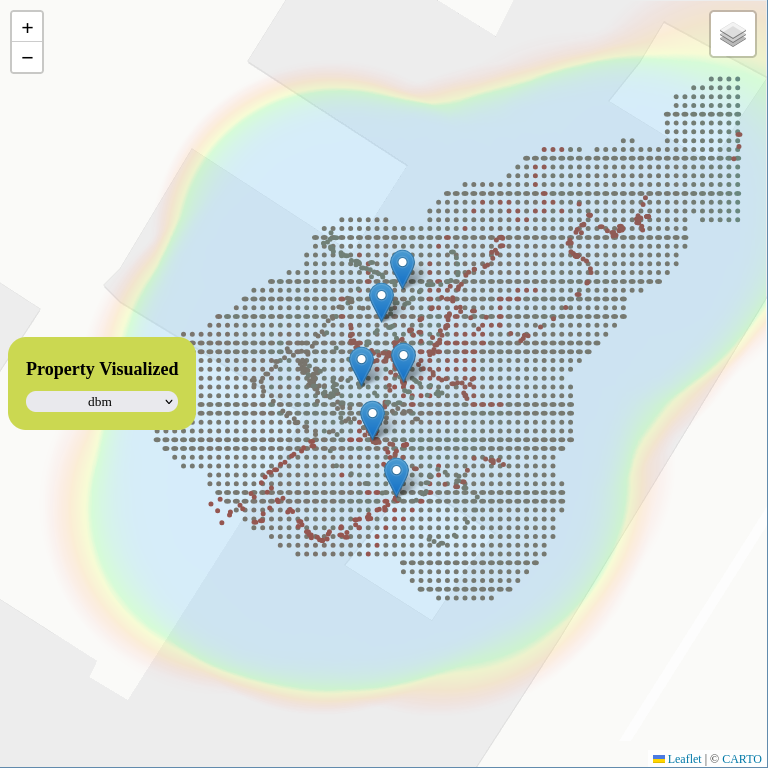

# Measurements Backend Bridge

This project is a FastAPI backend for managing, processing, and estimating signal measurements in different rooms using AI models. It provides RESTful endpoints for room and measurement management, dataset preparation, model training, and signal map estimation.
It servers a a bridge between a web application and an IA module that allows estimation of nearby measurements via an Autoencoder.


<div align="center">
    
    
</div>


## Features

- **AI Signal Estimation:** Endpoints to train and run AI models for signal strength estimation.
- **Dataset Generation:** Automated dataset creation for individual rooms and global training.
- **Autoencoder Training:** Background training of autoencoder models for signal data.
## Project Structure

```
.
├── main.py                  # FastAPI app entry point
├── db.py                    # MongoDB connection and collections
├── routers/                 # FastAPI routers (API endpoints)
│   └── signal_estimator.py
├── generated/               # Generated datasets and model outputs
├── requirements.txt         # Python dependencies
├── README.md                # Project documentation
└── .gitignore
```

## Setup


1. **Create and activate a virtual environment:**
    ```sh
    python3 -m venv env-ai-measurements-backend
    source env-ai-measurements-backend/bin/activate
    ```

2. **Install dependencies:**
    ```sh
    pip install -r requirements.txt
    ```

3. **Install the required AI signal cleaner package:**
    ```sh
    pip install -e ../backend.ai.signal_cleaner
    ```

4. **Set up MongoDB:**
    - Ensure MongoDB is running locally on `localhost:27017`.
    - The database used is `measurements_espaciosoa`.

5. **Run the server:**
    ```sh
    uvicorn main:app --reload
    ```
6. **Deployment with pm2 and Uvicorn **

    ```sh
    pm2 start .venv/bin/uvicorn --name "{theAliasYouWantToGiveThisProject}" --interpreter none -- \
    main:app --host 0.0.0.0 --reload
    ```


## API Usage

- **Signal Estimation:**  
  `POST /ia_estimator/runTraining/{roomName}` — Run training for a specific room.  
  `POST /ia_estimator/runGlobalTraining` — Run global dataset training.  
  `POST /ia_estimator/entrenarAutoencoder` — Train the autoencoder model.  
  `POST /ia_estimator/estimarMapa` — Estimate the signal map for a room.  
  `GET /ia_estimator/mapa-json/{room_name}` — Get the estimated map as JSON.

- **Job Status:**  
  `GET /ia_estimator/jobStatus/{jobId}` — Check the status of a training job.

## Development Notes

- The backend expects the [backend.ai.signal_cleaner](../backend.ai.signal_cleaner) package to be available.
- Generated datasets and model outputs are stored in the `generated/` directory.
- CORS is enabled for development and production domains.

---
